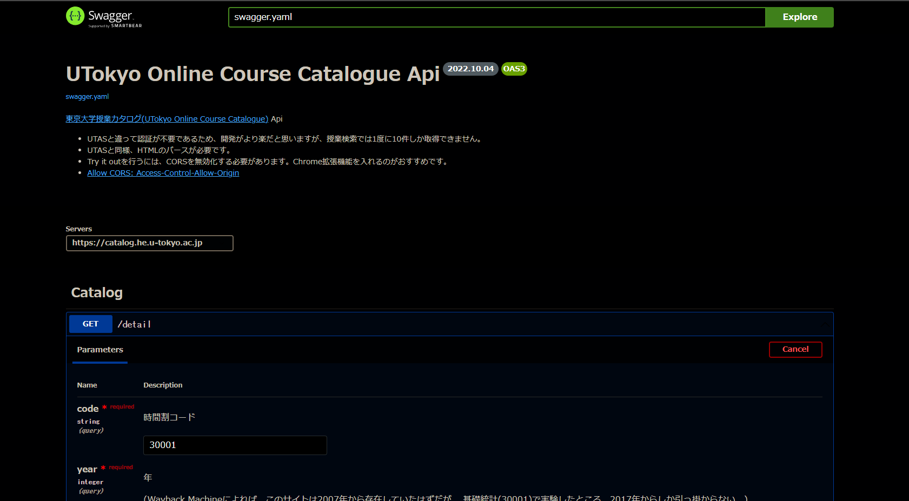

# UTokyo Online Course Catalogue Api

[東京大学授業カタログ(UTokyo Online Course Catalogue)](https://catalog.he.u-tokyo.ac.jp) Api の Swagger (UI)です。

[](https://34j.github.io/ut-course-catalog-swagger/)



## Notes

- ページを開くには、CORSを有効化する必要があります。
- Try it outを行うには、CORSを無効化する必要があります。
- CORSを無効化するには、Chrome拡張機能を入れるのがおすすめです。
  - [Allow CORS: Access-Control-Allow-Origin](https://chrome.google.com/webstore/detail/allow-cors-access-control/lhobafahddgcelffkeicbaginigeejlf/related?hl=ja)
- トップディレクトリにあるOpenAPI Specificationファイルのライセンスは以下の通りです。

```txt
Copyright 2022 34j and Contributors.
https://opensource.org/licenses/MIT
```
